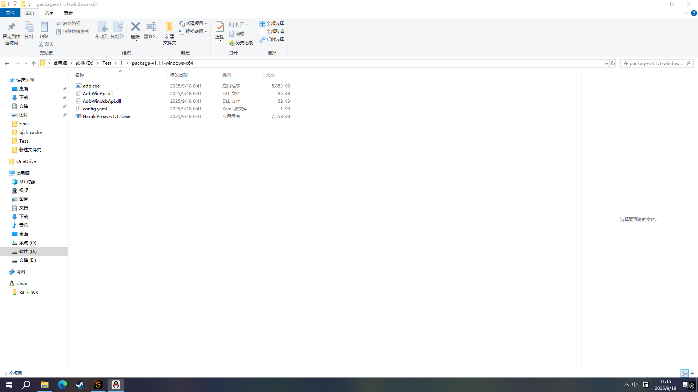
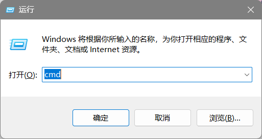
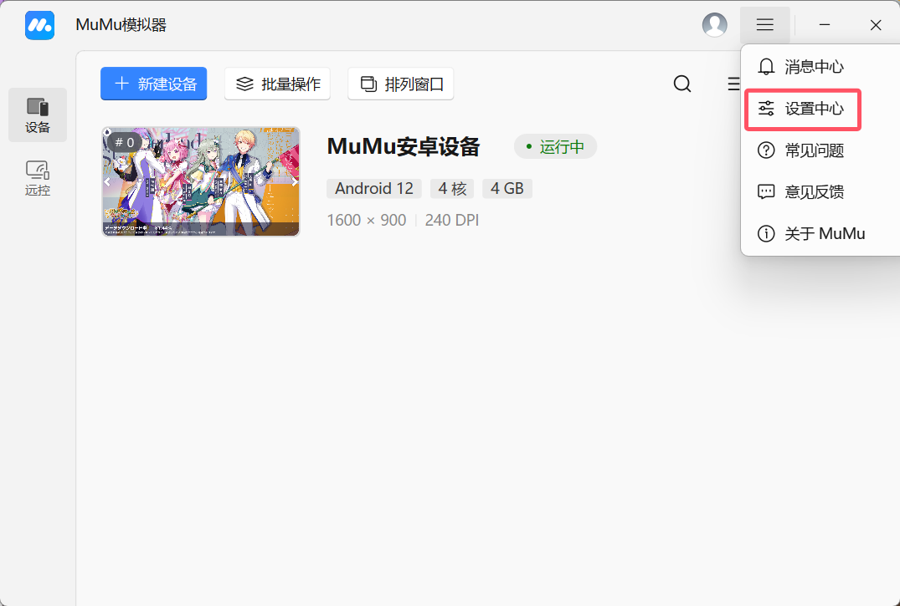
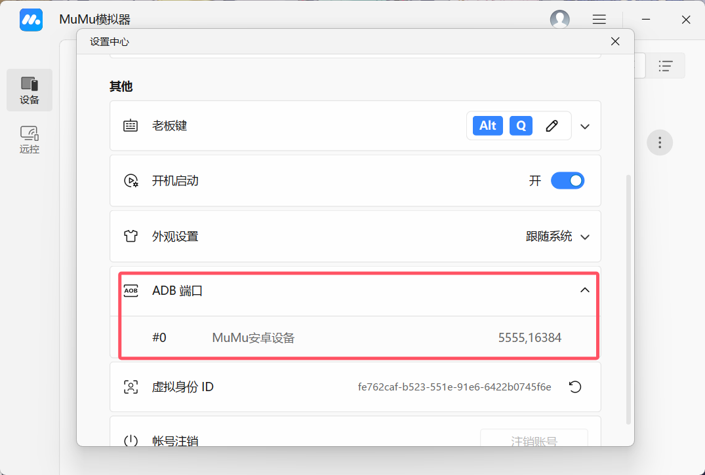
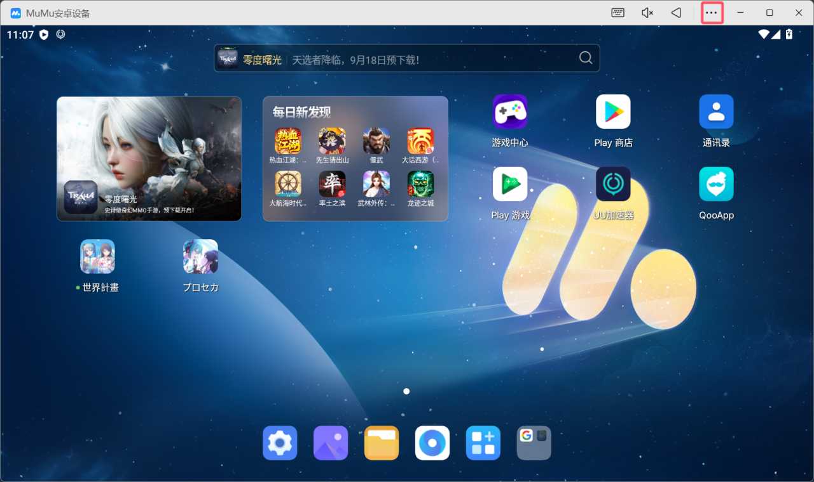
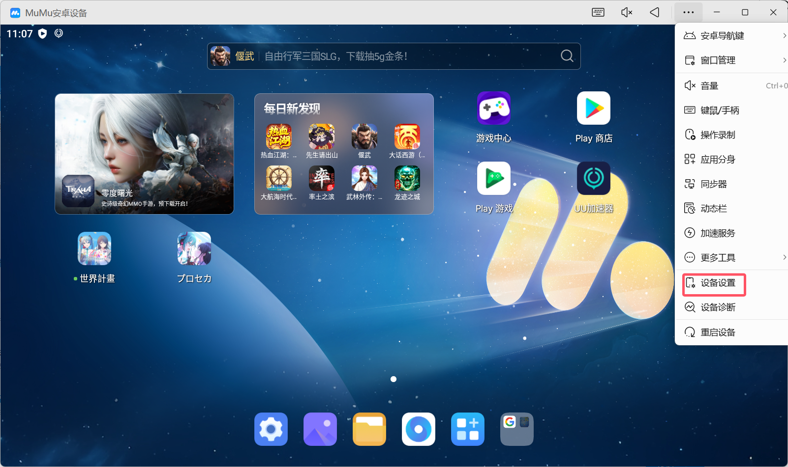
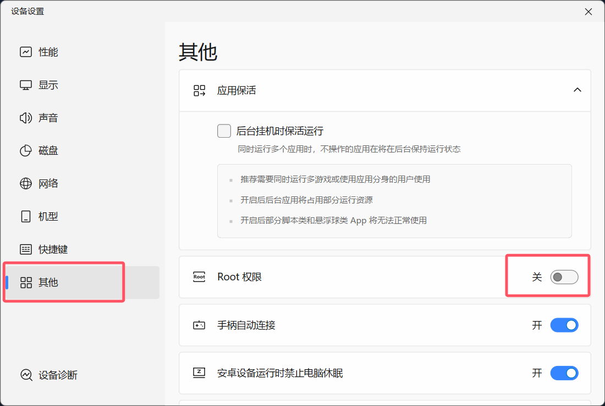
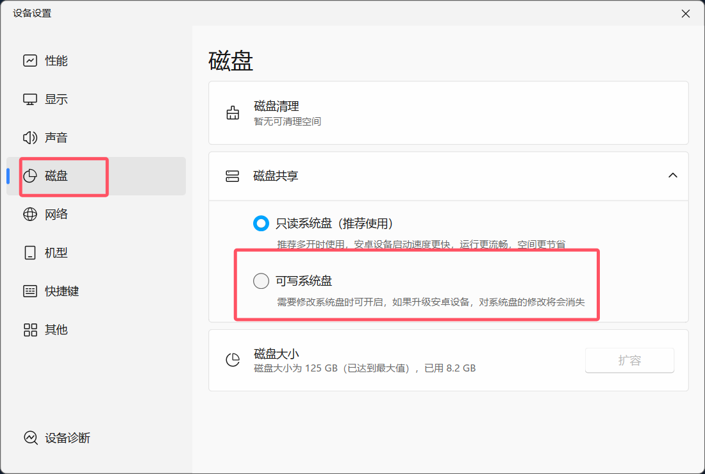

# HarukiProxy 介绍与教程

## 什么是HarukiProxy
HarukiProxy是由*Haruki Dev Team*开发的一款Android平台**半自动**抓取游戏pjsk的数据的程序

## HarukiProxy的特点
- 支持`日服`、`台服`、`韩服`、`国际服`数据抓取
- 支持**自动上传数据**到Haruki工具箱
- 支持选择是否公开自己自动上传到Haruki工具箱的数据在公开API访问
- 支持自定义上传数据端点 (需第三方服务支持)
- 支持保存抓取的数据到本地
- 支持保存抓取的suite数据到本地
- 支持保存抓取的mysekai数据到本地
- 支持自动为**MuMu模拟器**或其他可Root和可写系统盘到Android设备/模拟器安装MitM证书
- 支持自动为Android设备设置HarukiProxy为代理
- 支持自定义上游HTTP代理

## **初期准备**

***本程序自动化功能仅针对MuMu模拟器或其他可手动获取root可写系统盘的设备***

***如果你的Android手机正在使用Magisk/KernelSU等程序，请搜索“Always Trust User Certs”获取详细教程，并且手动设置代理服务器，本文不再赘述***

根据你的系统，选择并下载最新版的HarukiProxy

- [HarukiProxy-Windows](/HarukiProxy/HarukiProxy-v1.4.0-windows-x64.zip)
- [HarukiProxy-Linux-amd64](/HarukiProxy/HarukiProxy-v1.4.0-linux-amd64.tar.gz)
- [HarukiProxy-Linux-arm64](/HarukiProxy/HarukiProxy-v1.4.0-linux-arm64.tar.gz)
- [HarukiProxy-macOS-arm64](/HarukiProxy/HarukiProxy-v1.4.0-macos-arm64.tar.gz)

下载完成后，将压缩包放至自己喜欢的目录，然后进行解压

> [!caution]
>
> ***请不要使用系统自带的解压方式！！！由于会产生很多不必要的问题，这里极度建议下载一个解压软件对压缩包进行解压***
>
> ***本文推荐使用7-zip 官网地址：https://www.7-zip.org/***

解压后，目录应该有如下文件



```
目录名：HarukiProxy-v1.1.1-windows-x64
adb.exe
AdbWinApi.dll
AdbWinUsbApi.dll
config.yaml
harukiProxy-v1.1.1.exe
如果没有开启查看后缀名，可能会看不到.后的内容
```

> [!tip]
>
> 如果你的系统不是Windows，请自行准备adb工具，并且添加到环境变量里

## 配置config.yaml

推荐使用vscode等专业编辑器进行配置，记事本也可以使用，但有可能出错

打开文件后，默认配置应该如下

```
# 是否不公开你的数据在Haruki Suite API公开API上，如果是请保持为true，如果想公开则改为false
private: true

# MitM监听，一般情况下无需更改
listen: "0.0.0.0:8888"

# 是否启用 ADB
adb: true

# 手动设置代理IP，如果自动获取IP并设置会导致模拟器/设备无法联网，请填写此项
android_proxy_ip: ""

# 启用调试模式，如果有问题时请改为true，否则保持false即可
goproxy_debug: false

# 上游代理，如果连接状况不佳可以设置，否则留空即可
goproxy_upstream_proxy: ""

# Android 设备列表
devices:

  # 无线设备（IP:端口）
  - serial: ""
    wireless: "127.0.0.1:16448"

  # 可继续添加更多设备
  # - serial: "device_serial"
  #   wireless: "ip:port"
```

我们所要做的主要改动有以下几点

```
# 手动设置代理IP，如果自动获取IP并设置会导致模拟器/设备无法联网，请填写此项

android_proxy_ip: ""
```

1. **该步骤如果模拟器没有遇到网络问题则可以跳过到2.**

请将你正在操作的这台电脑（抑或是其它设备，总之是你要运行MuMu模拟器和HarukiProxy的这台设备）的ip地址填入""中

如果你不知道自己的ip地址的话，请按照以下流程

- Windows：同时按下键盘上的WIN+R两个键，右下角会弹出“运行”窗口，在窗口中输入cmd并回车



接着，在弹出的界面中输入ipconfig，从出现的内容中找到以太网适配器 以太网 或 无线局域网适配器 WLAN，下方的IPV4/IPV6地址即为你的当前地址


2. 接着，在上述配置文件中找到**# 无线设备（IP:端口）**，并修改它下面

```
 - serial: ""

  wireless: "127.0.0.1:16448"
```

中wireless后面的这串数字:后的16448改为**你模拟器**的adb端口

### 端口的获取方式

1. 在MuMu模拟器的模拟器管理界面，也就是打开之后的初始界面，点击右上角的三条杠


2. 之后选择设备中心



3. 向下滑找到ADB端口



4. 点开之后找到你准备进行抓包流程的那个模拟器，有右边的就是ADB端口（如果看到多个数字，都可以使用）

```
结果为wireless: "127.0.0.1:你得到的模拟器的端口"
```

**主要配置结束**

> [!tip]
>
> 还有一个比较重要的选项
>
> ```
> # 是否不公开你的数据在Haruki Suite API公开API上，如果是请保持为true，如果想公开则改为false
> 
> private: true
> ```
>
> 如果你只想要haruki bot获取到你的数据，那么就保持原样
>
> 如果你想要其它有权获取HARUKI API公开数据的bot也能接收数据，就修改为True

### 上游代理设置

如果你不知道这个板块是什么那就直接看下一个板块

在代理软件里找到端口号，填写http://127.0.0.1:端口号

> [!caution]
>
> 记得按下ctrl+s来保存你所做的更改

## 更改MuMu模拟器设置

1. 接着，打开你的MuMu模拟器，点击右上角的**. . .**  ，



2. 并在弹出的菜单里选择设备设置



3. 在设备设置中选择最下面的“其他”，找到root权限后点击右边的按钮开启



4. 之后，选择“磁盘”，点击其中的磁盘共享，然后将只读系统盘切换为可写系统盘，然后根据提示重启MuMu模拟器



5. 之后，在你的MuMu模拟器上下载你要抓包的服务器版本，随后和你之前做过的一样进入游戏下载数据，进入游戏，确认自己能够进入游戏主界面后我们便完成了准备工作

***请注意，如果你在这个阶段无法连接游戏服务器或者下载数据过慢，可以点击. . .选择游戏加速功能，里面有UU加速器可供使用***

## 安装证书

现在回到解压HarukiProxy的目录，双击HarukiProxy-v1.1.1.exe来打开，随后回到MuMu模拟器，当弹出请求root权限时选择允许,之后等待HarukiProxy完成自己的工作，当HarukiProxy弹出请重启模拟器的提示时，重启模拟器来完成证书安装


> [!caution]
>
> **弹出请重启模拟器的提示前请不要退出MuMu模拟器，否则证书会安装失败***
>
> ***如果你前面使用了MuMu模拟器自带的游戏加速功能，或是你自己在模拟器里使用了什么加速器，这时都该关掉了，不然接下来会抓取不到数据***

## 抓取

重启完模拟器后，HarukiProxy应该会弹出

```
goproxy MITM 代理启动: 0.0.0.0:8888
```

随后出现一些开头为WARN的消息，如果格式为Cannot read TLS response那就是正常现象

### suite数据

在登录界面进行登录操作后可以抓取

## mysekai数据

打开mysekai，等到你的豆腐人走出房门，那么Mysekai数据抓取就顺利完成了

使用HarukiProxy进行抓取时，在终端不会出现任何的成功提示

请使用msa或者msm进行测试是否抓包成功

> [!caution]
>
> 当你抓包结束后不需要抓包时请使用快捷键ctrl+c退出exe程序，直接关闭窗口将不保证能清除代理

## 全局设置清理（恢复模拟器网络）

当你使用HarukiProxy完成抓包后，如果模拟器没能正常联网，则可以使用adb工具进行设置的全局代理

进入CMD(在文章的确认主机IP已提到过)，之后在终端输入

```
adb -s 127.0.0.1:16384 shell settings put global http_proxy :0
```

之后重启模拟器

即可恢复网络

## HarukiProxy 更新记录

### v1.4.0
- 新增是否自动上传到Haruki Toolbox
- 新增自定义上传数据端点
- 新增是否保存数据到本地
- 新增是否保存suite数据到本地
- 新增是否保存mysekai数据到本地
- 新增是否自动通过adb安装证书

### v1.2.0
- 为生成Root CA时的CA名字添加随机参数
- 退出程序时自动清理adb设备的代理

### v1.1.1
- 添加Haruki声明

### v1.1.0
- 改善获取内网IP的逻辑

### v1.0.0
- 初版